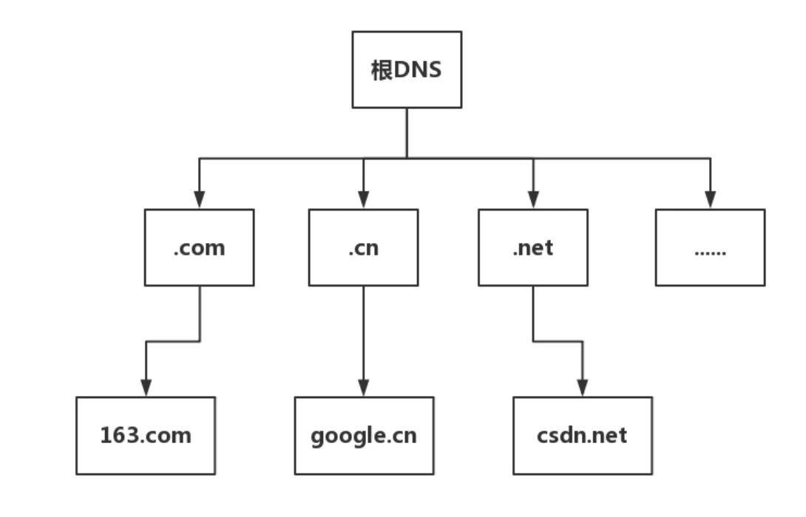
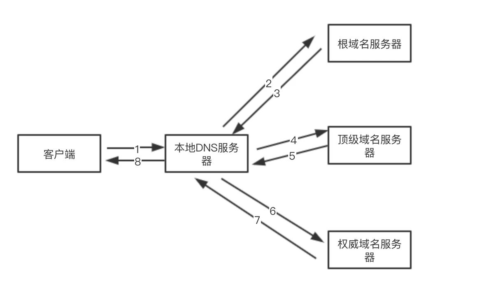

# 浏览器输入URL后发生了什么

## DNS 域名解析

在网络世界，你肯定记得住网站的名称，但是很难记住网站的 IP 地址，因而也需要一个地址簿，就是 DNS 服务器。DNS 服务器是高可用、高并发和分布式的，它是树状结构，如图：

- 根 DNS 服务器 ：返回顶级域 DNS 服务器的 IP 地址
- 顶级域 DNS 服务器：返回权威 DNS 服务器的 IP 地址
- 权威 DNS 服务器 ：返回相应主机的 IP 地址

DNS的域名查找，在客户端和浏览器，本地DNS之间的查询方式是递归查询；在本地DNS服务器与根域及其子域之间的查询方式是迭代查询；

在客户端输入 URL 后，会有一个递归查找的过程，**从浏览器缓存中查找->本地的hosts文件查找->找本地DNS解析器缓存查找->本地DNS服务器查找**，这个过程中任何一步找到了都会结束查找流程。

**如果本地DNS服务器无法查询到，则根据本地DNS服务器设置的转发器进行查询。若未用转发模式，则`迭代查找`过程如下图：**

**浏览器通过向 DNS 服务器发送域名，DNS 服务器查询到与域名相对应的 IP 地址，然后返回给浏览器，浏览器再将 IP 地址打在协议上，同时请求参数也会在协议搭载，然后一并发送给对应的服务器。**

当然，值得注意的是，浏览器提供了DNS数据缓存功能。即如果一个域名已经解析过，那会把解析的结果缓存下来，下次处理直接走缓存，不需要经过 DNS解析。

## 发起 TCP 连接

TCP连接建立，两次不安全，四次浪费资源，三次刚刚好。

从最开始双方都处于`CLOSED`状态。然后服务端开始监听某个端口，进入了`LISTEN`状态。

- 第一次握手

客户端主动发起连接，发送`SYN`, 发送完毕后，客户端进入`SYN-SENT`状态。

- 第二次握手

服务端接收到，返回`SYN和ACK`(对应客户端发来的SYN)，发送完毕后，服务器端进入`SYN_RCVD`状态。

- 第三次握手

客户端再发送`ACK`给服务端，发送完毕后，客户端进入`ESTABLISHED`状态；服务端收到ACK之后，也进入`ESTABLISHED`状态，TCP 握手结束。

## 发送HTTP请求

**TCP 三次握手结束后，开始发送 HTTP 请求报文。**

请求报文由请求行（request line）、请求头（header）、请求体三个部分组成,如下图所示：

## 服务器处理请求并返回响应结果

## 浏览器解析渲染页面

### 构建 DOM 树

### 

## 断开连接

四次挥手后，client和server成功地断开了连接~

刚开始双方处于`ESTABLISHED`状态。

- 第一次挥手

客户端想要关闭连接，向服务器发送`FIN`报文，发送完毕后，客户端进入`FIN_WAIT_1`状态。

- 第二次挥手

服务端收到该`FIN`报文后，就向客户端发送`ACK`应答报文，接着服务端进入`CLOSED_WAIT`状态。

客户端接收到服务端的`ACK`应答报文后，进入`FIN_WAIT_2`状态。

- 第三次挥手

服务端处理完数据后，向客户端发送`FIN`报文，发送完毕后，服务器端进入`LAST_ACK`状态。

- 第四次挥手

客户端接收到来自服务端的`FIN`报文后，回一个`ACK`应答报文，并进入`TIME_WAIT`状态。

服务端接收到这个确认包之后，关闭连接，进入`CLOSED`状态，至此**服务端已经完成连接的关闭**。

客户端等待了`2MSL`之后，自动进入`CLOSED`状态，**至此客户端也完成连接的关闭**。

